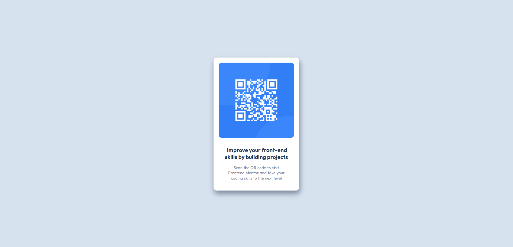

<h1 align="center">QR code component</h1>

  <h3>
    <a href="">
      Live
    </a>
    | 
    <a href="">
      Solution
    </a>
    | 
    <a href="">
      Challenge
    </a>
  </h3>

</img>

## About the Project

The challenge is to build out this QR code component and get it looking as close to the design as possible. For this purpose you can use any tools you like to help you complete the challenge.

This is a solution to the [QR code component challenge on Frontend Mentor](https://www.frontendmentor.io/challenges/qr-code-component-iux_sIO_H). Frontend Mentor challenges help you improve your coding skills by building realistic projects.

## Built with

- Semantic HTML5 markup
- CSS custom properties
- SASS/SCSS
- Grid
- BEM naming convention
- Mobile-first workflow

## Author

- Frontend Mentor - <a href="https://www.frontendmentor.io/profile/MaciejNarejko">@MaciejNarejko</a>

## Acknowledgments

Thanks to the FrontendMentor.io community for a code review.
Together we create better code.
